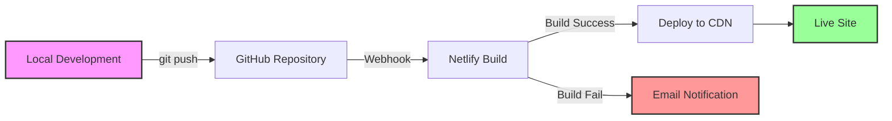

# 🚀 Netlify Deployment Guide for Cielito's Wrld

This guide will walk you through deploying your Next.js photography portfolio to Netlify.

---

## ✅ Pre-Deployment Checklist

### Build Status
- ✅ **Build Test Passed**: `npm run build` completes successfully
- ✅ **TypeScript Errors**: Resolved (Suspense boundary added)
- ✅ **Metadata**: Fixed Open Graph image warnings
- ✅ **Netlify Config**: Created `netlify.toml`

### Required Files
- ✅ `netlify.toml` - Netlify configuration
- ✅ `.env.local.example` - Environment variables template
- ✅ `package.json` - Dependencies and scripts
- ✅ `next.config.js` - Next.js configuration

---

## 📋 Step-by-Step Deployment

### **Step 1: Prepare Your Sanity CMS Credentials**

You'll need these values from your Sanity project:

1. **Get Sanity Project ID**:
   ```bash
   # Check your sanity.cli.ts or sanity.config.ts
   cat sanity.cli.ts
   ```
   
   Or find it in your Sanity dashboard: https://www.sanity.io/manage

2. **Dataset Name**: Usually `production` (check your Sanity dashboard)

3. **API Version**: `2024-01-01` (already configured)

---

### **Step 2: Create Netlify Account & New Site**

1. Go to [Netlify](https://www.netlify.com/) and sign up/login
2. Click **"Add new site"** → **"Import an existing project"**
3. Connect your Git provider (GitHub, GitLab, or Bitbucket)
4. Select your repository: `CielitosWrld/SITE`
5. Configure build settings:

   **Build Settings:**
   ```
   Base directory: (leave empty)
   Build command: npm run build
   Publish directory: .next
   ```

---

### **Step 3: Configure Environment Variables**

In Netlify dashboard → **Site settings** → **Environment variables**, add:

#### **Required Variables:**

| Variable Name | Value | Example |
|--------------|-------|---------|
| `NEXT_PUBLIC_SANITY_PROJECT_ID` | Your Sanity project ID | `m7ryk78v` |
| `NEXT_PUBLIC_SANITY_DATASET` | Your dataset name | `production` |
| `NEXT_PUBLIC_SANITY_API_VERSION` | API version | `2024-01-01` |
| `NEXT_PUBLIC_SITE_URL` | Your Netlify URL | `https://your-site.netlify.app` |

#### **Optional Variables:**

| Variable Name | Value | Purpose |
|--------------|-------|---------|
| `SANITY_API_TOKEN` | Sanity read token | For preview mode (optional) |
| `NEXT_PUBLIC_GA_ID` | Google Analytics ID | Analytics tracking (optional) |

**How to add variables:**
1. Click **"Add a variable"**
2. Select **"Add a single variable"**
3. Enter **Key** and **Value**
4. Choose **"Same value for all deploy contexts"** (or customize per environment)
5. Click **"Create variable"**

---

### **Step 4: Install Netlify Next.js Plugin**

The `netlify.toml` file already includes the Next.js plugin configuration:

```toml
[[plugins]]
  package = "@netlify/plugin-nextjs"
```

Netlify will automatically install this plugin during deployment.

---

### **Step 5: Deploy!**

1. Click **"Deploy site"** in Netlify
2. Wait for the build to complete (usually 2-5 minutes)
3. Once deployed, you'll get a URL like: `https://your-site-name.netlify.app`

---

## 🔧 Post-Deployment Configuration

### **1. Custom Domain (Optional)**

1. Go to **Site settings** → **Domain management**
2. Click **"Add custom domain"**
3. Enter your domain (e.g., `cielitos-wrld.com`)
4. Follow DNS configuration instructions
5. Netlify will automatically provision SSL certificate

### **2. Update Metadata Base URL**

Once you have your final domain, update the metadata base URL:

**File:** `app/layout.tsx` (line 85)

```tsx
// Change from:
metadataBase: new URL('https://cielitos-wrld.com'),

// To your actual domain:
metadataBase: new URL('https://your-actual-domain.com'),
```

### **3. Configure Sanity CORS**

Allow your Netlify domain to access Sanity:

1. Go to [Sanity Manage](https://www.sanity.io/manage)
2. Select your project
3. Go to **Settings** → **API** → **CORS Origins**
4. Click **"Add CORS origin"**
5. Add your Netlify URL: `https://your-site.netlify.app`
6. Check **"Allow credentials"**
7. Save

**Add both:**
- `https://your-site.netlify.app` (production)
- `http://localhost:3000` (local development)

---

## 🎯 Deployment Features

### **Automatic Deployments**
- ✅ Every push to `main` branch triggers a new deployment
- ✅ Preview deployments for pull requests
- ✅ Rollback to previous deployments anytime

### **Performance Optimizations**
- ✅ Next.js Image Optimization via Netlify
- ✅ Incremental Static Regeneration (ISR) with 60s revalidation
- ✅ CDN distribution worldwide
- ✅ Automatic HTTPS/SSL

### **Build Configuration**
- ✅ Node.js 18.17.0
- ✅ Next.js 16.0.7 (Turbopack)
- ✅ TypeScript build errors ignored for Sanity schemas
- ✅ Security headers configured

---

## 🐛 Troubleshooting

### **Build Fails with "Module not found"**
**Solution:** Check that all dependencies are in `package.json`:
```bash
npm install
npm run build  # Test locally first
```

### **Images Not Loading**
**Solution:** 
1. Verify Sanity CORS settings include your Netlify domain
2. Check environment variables are set correctly
3. Ensure `cdn.sanity.io` is in `next.config.js` remote patterns

### **Sanity Studio Not Working**
**Solution:**
1. Verify all Sanity environment variables are set
2. Check that `/studio` route is accessible
3. Ensure Sanity dataset is `production` (not `development`)

### **404 on Page Refresh**
**Solution:** The `netlify.toml` includes redirect rules. If issues persist:
1. Check `netlify.toml` is in the root directory
2. Verify the redirect rule is present:
   ```toml
   [[redirects]]
     from = "/*"
     to = "/index.html"
     status = 200
   ```

### **Environment Variables Not Working**
**Solution:**
1. Ensure variables start with `NEXT_PUBLIC_` for client-side access
2. Redeploy after adding/changing environment variables
3. Check variable names match exactly (case-sensitive)

---

## 📊 Monitoring & Analytics

### **Netlify Analytics**
- Go to **Analytics** tab in Netlify dashboard
- View page views, bandwidth, and performance metrics

### **Build Logs**
- Click on any deployment to view detailed build logs
- Useful for debugging build failures

### **Deploy Previews**
- Every pull request gets a unique preview URL
- Test changes before merging to production

---

## 🔄 Continuous Deployment Workflow



**Workflow:**
1. Make changes locally
2. Test with `npm run dev`
3. Commit and push to GitHub
4. Netlify automatically builds and deploys
5. Check deploy logs for any issues
6. Site goes live in 2-5 minutes

---

## 🎨 Performance Optimization Tips

### **1. Image Optimization**
- ✅ Already configured with Next.js Image component
- ✅ Sanity CDN serves optimized images
- ✅ LQIP (Low-Quality Image Placeholders) enabled

### **2. Caching Strategy**
The `netlify.toml` includes cache headers:
- JavaScript/CSS: 1 year cache
- Images: 1 year cache
- HTML: No cache (for ISR)

### **3. ISR (Incremental Static Regeneration)**
Pages revalidate every 60 seconds:
- Homepage: Fresh content every minute
- Blog/Gallery: Auto-updates on content changes
- Work pages: Static with on-demand revalidation

---

## 🔐 Security Checklist

- ✅ **HTTPS**: Automatically enabled by Netlify
- ✅ **Security Headers**: Configured in `netlify.toml`
  - X-Frame-Options: DENY
  - X-Content-Type-Options: nosniff
  - X-XSS-Protection: enabled
- ✅ **Environment Variables**: Never commit `.env.local` to Git
- ✅ **Sanity CORS**: Only allow your domains
- ✅ **API Tokens**: Keep Sanity tokens secret (if using preview mode)

---

## 📝 Quick Reference

### **Useful Commands**

```bash
# Test build locally
npm run build

# Start production server locally
npm run start

# Development server
npm run dev

# Lint code
npm run lint
```

### **Important URLs**

- **Netlify Dashboard**: https://app.netlify.com
- **Sanity Studio (Local)**: http://localhost:3000/studio
- **Sanity Studio (Production)**: https://your-site.netlify.app/studio
- **Sanity Manage**: https://www.sanity.io/manage

### **Support Resources**

- [Netlify Docs](https://docs.netlify.com/)
- [Next.js Deployment](https://nextjs.org/docs/deployment)
- [Sanity Docs](https://www.sanity.io/docs)

---

## ✅ Deployment Checklist

Before going live, verify:

- [ ] Build passes locally (`npm run build`)
- [ ] All environment variables configured in Netlify
- [ ] Sanity CORS includes Netlify domain
- [ ] Custom domain configured (if applicable)
- [ ] SSL certificate active
- [ ] Test all pages on production URL
- [ ] Test Sanity Studio at `/studio`
- [ ] Verify images load correctly
- [ ] Check mobile responsiveness
- [ ] Test contact form (if applicable)
- [ ] Set up analytics (optional)

---

## 🎉 You're Ready to Deploy!

Your project is **production-ready** for Netlify deployment. Follow the steps above, and you'll have your photography portfolio live in minutes!

**Questions?** Check the troubleshooting section or Netlify's excellent documentation.

---

*Last updated: December 10, 2025*
